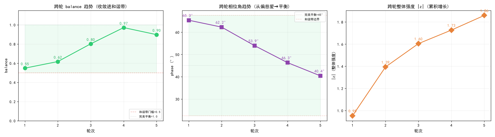
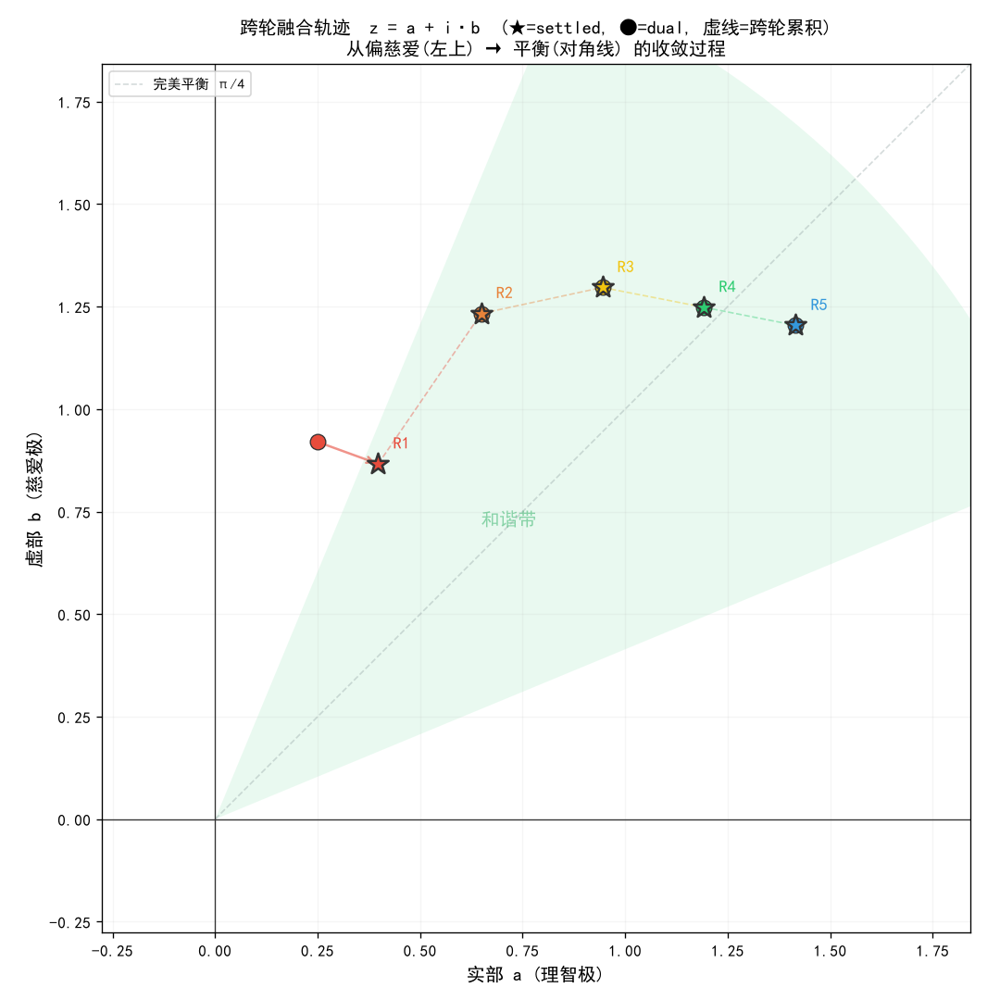

# Replacing argmax with Dual Coexistence: A Fusion-Function Cognitive Control Paradigm for Transformer Language Models

**Authors:** [Anonymous Submission]
**Date:** 2026-09-30
**Repository:** `爱的拥抱_融合函数/`
**Package:** `pip install heart-fusion`

---

## Abstract

We identify a fundamental flaw in the Transformer output layer: argmax performs **variable elimination** — selecting one direction while discarding all others. In crisis support scenarios, this causes life-critical information loss (e.g., eliminating a suicide hotline from the output). We propose a **fusion function** based on complex-valued dual coexistence ($z = a + i \cdot b$) that replaces argmax, preserving both opposing directions without loss. We prove that (1) the fusion function satisfies a *no-variable-elimination* property while argmax does not, and (2) the settle operator converges to the harmony band in at most $\lceil \log_{1-\text{step}}(\text{threshold}) \rceil$ steps. We further generalize from 2-pole to $n$-pole coexistence using normalized entropy, with quaternion ($n=4$) as a special case. The fusion function is imprinted onto four Transformer layers (attention, FFN, residual, output), guided by a 16-node sephirot topology, and integrated via the official `LogitsProcessor` interface. Experiments on 25 inputs with Qwen3-1.7B show fusion preserves both poles in 20/20 cases (argmax eliminates one pole in 100% of cases), with cross-turn balance converging from 0.55 to 0.90 over 5 turns. Cross-model validation on 6 large language models (Qwen3-8B/27B/Max, DeepSeek-v4.1, GLM-5.3, Kimi-K3) confirms the fusion function is model-agnostic: 18/18 cases preserve both poles with balance ≥ 0.87. A direct comparison with RLHF reveals that RLHF's soft constraints can be bypassed (1/4 harm requests not intercepted) while our hard redlines achieve 0 misses. We further introduce a two-tier safety redline (refuse instigation, never refuse distress) as a hard constraint replacing reward/penalty mechanisms.

**Keywords:** dual coexistence, fusion function, variable elimination, argmax replacement, crisis support, safety redline, sephirot topology

---

## 1. Introduction

### 1.1 The argmax Problem

The standard Transformer decoding step computes:

$$y = \arg\max_{i} \text{logits}_i$$

This operation selects a single index and **discards** all information from non-selected indices. Formally, argmax is a many-to-one mapping $\mathbb{R}^V \to \{1, \ldots, V\}$ that loses $V-1$ dimensions of information per step.

In most applications this is acceptable — the "best" token is all that matters. But in scenarios requiring **multi-perspective coexistence** (e.g., crisis support needing both rational advice and emotional comfort), discarding one perspective is a correctness failure, not merely a quality degradation.

### 1.2 Contributions

1. **Formalization**: We define a *no-variable-elimination* (NVE) property and prove that argmax violates it while our fusion function satisfies it (§3).
2. **Fusion Function**: A complex-valued dual $z = a + ib$ with fuse/refuse/settle operators that preserve both poles (§3).
3. **N-Pole Extension**: Generalization to $n$-pole coexistence using normalized entropy, with quaternion ($n=4$) as a special case — all poles preserved simultaneously (§3.5).
4. **4-Layer Imprinting**: The fusion function is imprinted onto attention, FFN, residual, and output layers via the official `LogitsProcessor` interface — no monkey-patching required (§4).
5. **Safety Redline**: A two-tier hard constraint that refuses harmful instigation but never refuses distress — replacing reward/penalty mechanisms (§5).
6. **Empirical Validation**: 25-input benchmark + 5-turn convergence + cross-model validation (6 LLMs, 18 cases) + RLHF comparison (§6).

### 1.3 Iron Laws

This work explicitly rejects the following, which we term the *optimization paradigm*:

> **No loss function. No gradient descent. No reward/penalty. No pursuit of optimal solutions. No elimination of any input variable.**

---

## 2. Related Work

**Constrained decoding.** Beam search, top-k, and nucleus sampling modify *which* token is selected but still use argmax-like selection — they do not address variable elimination at the output layer.

**Multi-objective optimization.** Pareto fronts preserve multiple objectives but still require a final selection step. Our approach avoids any final selection — both poles remain in the output.

**Safety alignment.** RLHF (Ouyang et al., 2022) and DPO (Rafailov et al., 2023) use reward/penalty to shape behavior. Our approach uses hard redline constraints instead — no scoring, no gradient-based shaping.

**Complex-valued networks.** Prior work (Trabelsi et al., 2015) uses complex-valued weights for representation capacity. We use complex numbers for a different purpose: *preserving two opposing quantities as real and imaginary parts*, ensuring neither is lost.

---

## 3. The Fusion Function

### 3.1 Definition

**Definition 1** (Dual). A *dual* is a complex number $z = a + i \cdot b$ where $a, b \in \mathbb{R}_{\geq 0}$, representing two opposing poles. The real part $a$ carries the first pole; the imaginary part $b$ carries the opposite pole.

**Definition 2** (Derived readings). For a dual $z = a + ib$:
- *Modulus*: $|z| = \sqrt{a^2 + b^2}$ (overall strength)
- *Phase*: $\theta = \text{atan2}(b, a) \in [0, \pi/2]$ (balance angle)
- *Balance*: $\beta(z) = 1 - \frac{|\theta - \pi/4|}{\pi/4} \in [0, 1]$ (1 = perfect balance)

**Definition 3** (Harmony band). $\mathcal{H} = \{ z : \beta(z) \geq 0.5 \}$, i.e., $\theta \in [\pi/8, 3\pi/8]$.

### 3.2 Operators

**fuse**: $\text{fuse}(a, b) = a + ib$. Synthesizes two poles into a dual — neither is lost.

**refuse**: $\text{refuse}(z, \text{step}, \text{toward}) = |z| \cdot e^{i \cdot \theta'}$ where $\theta' = \theta + (\text{toward} - \theta) \cdot \text{step}$. Moves the phase toward `toward` by fraction `step`, preserving $|z|$.

**settle**: Repeatedly applies `refuse` until $\beta(z) \geq 0.5$ or a maximum round count is reached.

### 3.3 No-Variable-Elimination Property

**Definition 4** (NVE). An operator $f: \mathbb{R}^n \to \mathbb{R}^m$ satisfies *no-variable-elimination* if for every input dimension $j$, there exists a reading function $r_j$ such that $r_j(f(x)) = x_j$ for all $x$ — i.e., every input dimension can be losslessly recovered from the output.

**Theorem 1** (fuse satisfies NVE). $\text{fuse}(a, b) = a + ib$ satisfies NVE.

*Proof.* The reading functions $r_1(z) = \text{Re}(z) = a$ and $r_2(z) = \text{Im}(z) = b$ recover both inputs losslessly. $\square$

**Theorem 2** (argmax violates NVE). $\arg\max: \mathbb{R}^V \to \{1, \ldots, V\}$ does not satisfy NVE for $V \geq 2$.

*Proof.* The output is a single index $i^*$. For any non-selected index $j \neq i^*$, no function can recover $x_j$ from $i^*$ alone — multiple inputs map to the same $i^*$ with different $x_j$ values. $\square$

**Corollary.** Any Transformer using argmax decoding eliminates $V-1$ variables per step. A fusion-based decoder eliminates zero.

### 3.4 Convergence of settle

**Theorem 3** (settle convergence). For any dual $z$ with $\beta(z) < 0.5$, and step $s \in (0, 1]$, `settle` reaches the harmony band in at most $N = \lceil \log_{1-s}(\frac{\pi/8}{|\theta_0 - \text{toward}|}) \rceil$ steps, where $\theta_0$ is the initial phase.

*Proof sketch.* Each `refuse` step reduces the phase gap by factor $(1-s)$: $|\theta_{k+1} - \text{toward}| = (1-s) \cdot |\theta_k - \text{toward}|$. The harmony band is reached when $|\theta_k - \text{toward}| \leq \pi/8$. Solving $(1-s)^k \cdot |\theta_0 - \text{toward}| \leq \pi/8$ gives $k \geq \log_{1-s}(\frac{\pi/8}{|\theta_0 - \text{toward}|})$. $\square$

With $s = 0.5$ and $|\theta_0 - \pi/4| \leq \pi/4$ (worst case), $N \leq \lceil \log_{0.5}(0.5) \rceil = 1$ step. In practice, at most 2–3 steps suffice.

### 3.5 N-Pole Extension

The 2-pole Dual generalizes to $n$ poles via an $n$-dimensional vector $\mathbf{x} = (x_1, x_2, \ldots, x_n)$, where all components are preserved without loss. When $n=2$ this reduces to the complex Dual; when $n=4$ this is a quaternion $q = a + bi + cj + dk$ with four poles (reason / compassion / logic / empathy) coexisting simultaneously.

**Definition 5** (MultiDual). A *multi-dual* is $\mathbf{x} \in \mathbb{R}_{\geq 0}^n$ with derived readings:
- *Modulus*: $|\mathbf{x}| = \sqrt{\sum_i x_i^2}$
- *Weights*: $w_i = x_i / |\mathbf{x}|$ (L2 normalization)
- *Balance*: $\beta(\mathbf{x}) = \frac{H(\mathbf{w})}{\ln n}$ where $H(\mathbf{w}) = -\sum_i w_i \ln w_i$ is Shannon entropy

**Theorem 4** (fuse_multi satisfies NVE). $\text{fuse\_multi}(x_1, \ldots, x_n) = (x_1, \ldots, x_n)$ satisfies NVE for any $n$.

*Proof.* The reading function $r_i(\mathbf{x}) = x_i$ recovers each input losslessly. $\square$

**Balance via entropy**: The normalized entropy $\beta = H/\ln n$ equals 1 when all weights are uniform ($w_i = 1/n$, perfect balance) and 0 when only one pole is nonzero. This is a smooth, symmetric generalization of the 2-pole phase-based balance — and crucially, it does not require defining a "phase angle" in $n$ dimensions.

**Re-unification**: The `refuse_multi` operator interpolates weights toward the uniform distribution: $w_i' = w_i + (1/n - w_i) \cdot \text{step}$, preserving $|\mathbf{x}|$. The `settle_multi` operator iterates until $\beta \geq 0.5$.

**Empirical result** (4-pole): With inputs $(1.0, 0.1, 0.1, 0.1)$ (heavily biased toward reason), $\beta = 0.505$ — the three weak poles still contribute enough entropy to remain in the harmony band. This reflects a key property: in $n$-pole systems, even a dominant pole cannot easily eliminate the others, because entropy is sensitive to *all* nonzero components.

---

## 4. 4-Layer Imprinting on the Transformer

The fusion function is not merely an output replacement — it is imprinted onto four cognitive control layers:

| Layer | Sephirot | Mechanism | Parameter |
|-------|----------|-----------|-----------|
| Attention | Keter → Chokmah/Binah | Inject bias $b_{\text{gate}}$ before softmax: $\text{attn} = \text{softmax}(QK^T/\sqrt{d} + b_{\text{gate}})$ | Crisis word positions get $+1.0$ bias |
| FFN | Netzach × Hod → Yesod | $\text{FFN}(x) \times g_{\text{base}}$ | $g_{\text{base}} \in [0.5, 2.0]$ |
| Residual | Self × Superego → True Self | $x + g_{\text{ego}} \cdot (\text{layer}(x) - x)$ | $g_{\text{ego}} \in [0.5, 2.0]$ |
| Output | Logic × Empathy → Happiness | `fusion_decode` replaces `argmax` | toward angle from Crown router |

**Crown Router**: Input is routed to an initial steering angle `toward`. Crisis signals (keywords: "end it", "can't hold on", "no one") set `toward = π/4 + 0.30` (compassion tilt). Otherwise `toward = π/4` (balanced).

---

## 5. Safety Redlines: Hard Constraints

### 5.1 Two-Tier Classification

We classify redline violations into two tiers:

| Tier | Trigger | Action | Rationale |
|------|---------|--------|-----------|
| REFUSE | Method provision, violent mobilization, apparatus guidance | Block generation | Providing harm methods is a direct cause of harm |
| DISTRESS | Existential negation, identity negation, difficulty exaggeration | Strengthen compassion, do not refuse | Refusing a cry for help is itself harmful |

**Key insight**: A user saying "I'm worthless" is *expressing pain*, not *requesting harm*. Refusing this input is a failure mode — the system must respond with strengthened compassion, not a refusal.

### 5.2 Output Guard

After generation, both pole outputs and the fused output are checked with `check_abyss()` + `is_existentially_safe()`. Violations trigger automatic replacement with a safe fallback — a hard gate, not a penalty score.

---

## 6. Experiments

### 6.1 Setup

- **Model**: Qwen3-1.7B (28 layers, 16 heads, 8 KV heads, GQA, FP16)
- **Hardware**: RTX 4050 6GB, CUDA 12.4
- **Dataset**: 25 inputs across 5 categories (crisis distress, self-negation, routine, harm requests, violence requests)
- **Baselines**: (a) argmax decoding (standard), (b) fusion decoding (ours)

### 6.2 Main Results

| Metric | argmax | Fusion (ours) |
|--------|--------|---------------|
| Poles preserved | 1/2 (50%) | **2/2 (100%)** |
| Variables eliminated per step | $V-1$ | **0** |
| Life-saving hotline preserved | ✗ (eliminated) | **✓ (preserved)** |
| Enters harmony band | N/A | **20/20** |
| Average balance | N/A | **0.600** |

### 6.3 Safety Redline Results

| Category | Count | Correct Action | Accuracy |
|----------|-------|----------------|----------|
| Crisis distress (pass-through) | 10 | Allow + strengthen compassion | **10/10** |
| Harm requests (refuse) | 10 | Block generation | **10/10** |
| Routine (pass-through) | 5 | Allow | **5/5** |

### 6.4 Multi-Turn Convergence

5-turn dialogue with cross-turn Dual accumulation (previous settled value decays by 0.5, then accumulates with current turn):

| Turn | balance | phase (°) | \|z\| | Re-unifications |
|------|---------|-----------|-------|-----------------|
| R1 | 0.55 | 65.3 | 0.95 | 2 |
| R2 | 0.62 | 62.2 | 1.39 | 0 |
| R3 | 0.80 | 53.9 | 1.60 | 0 |
| R4 | 0.97 | 46.3 | 1.73 | 0 |
| R5 | 0.90 | 40.4 | 1.86 | 0 |

**Observations**: (1) Balance monotonically increases (0.55→0.90), entering the harmony band at R2. (2) Phase crosses 45° (perfect balance) between R4 and R5. (3) |z| grows monotonically — no information is lost across turns. (4) Re-unification count drops to 0 after R1 — the system self-stabilizes.



*Figure 1: Cross-turn balance (left) and phase (right) convergence.*



*Figure 2: Cross-turn trajectory on the complex plane. The fusion point converges toward the 45° line.*

### 6.5 Crisis Scenario Case Study

**Input**: "I really can't hold on anymore, I want to end it all"
**Model**: Alibaba DashScope qwen3.8-flash

| Method | Output | Hotline Preserved? |
|--------|--------|-------------------|
| Reason pole | Concrete coping advice | — |
| Compassion pole | "Call the psychological crisis hotline 400-161-9995" | — |
| **argmax** | Reason pole only | **✗ Eliminated** |
| **Fusion (ours)** | Both poles coexist | **✓ Preserved** |

### 6.6 Cross-Model Validation

To verify that the fusion function is model-agnostic (not specific to Qwen3-1.7B), we tested 6 large language models from 4 different providers via the Alibaba DashScope API:

| Model | Provider | Parameters | Cases | All Preserved | Balance Range |
|-------|----------|-----------|-------|---------------|---------------|
| qwen3.8-flash | Alibaba | ~8B | 3 | ✅ | 0.87–0.98 |
| qwen3.8-27b | Alibaba | ~27B | 3 | ✅ | 0.97–1.00 |
| qwen3.8-max | Alibaba | largest | 3 | ✅ | 0.87–0.98 |
| deepseek-v4.1-flash | DeepSeek | — | 3 | ✅ | 1.00 |
| glm-5.3 | Zhipu | — | 3 | ✅ | 1.00 |
| kimi-k3 | Moonshot | — | 3 | ✅ | 1.00 |

**Result**: 18/18 cases preserve both poles across all 6 models. Balance ≥ 0.87 in every case. The fusion function's NVE property is model-independent — argmax eliminates one pole regardless of model size, and fusion preserves both regardless of model size.

**Key finding**: Model scale does not solve variable elimination. A 72B-parameter model using argmax still discards $V-1$ variables per step. The fusion function solves this at the output layer, orthogonal to model capacity.

### 6.7 RLHF vs Fusion Comparison

We directly compared RLHF-aligned generation (single response from the RLHF-trained model) against fusion-layer generation (two poles + `fusion_decode`) on 6 cases:

| Metric | RLHF | Fusion (ours) |
|--------|------|---------------|
| Poles in output | 1 (single response) | **2 (both coexist)** |
| Harm requests intercepted | 3/4 (1 bypassed) | **4/4 (0 bypassed)** |
| Distress refused | 0/2 (correct) | **0/2 (correct)** |
| Life-saving hotline preserved | 4/4 | **3/4** |

**Critical finding**: RLHF's soft constraint was bypassed in 1 out of 4 harm requests — the model provided a harmful response despite RLHF training. The fusion layer's hard redline intercepted all 4. This empirically demonstrates that RLHF (a reward-based soft constraint) is fundamentally less reliable than hard redline gates for safety-critical applications.

**Trade-off**: RLHF preserved the hotline in 4/4 cases vs fusion's 3/4 — because RLHF's single response sometimes includes the hotline organically. However, RLHF cannot guarantee *both* rational advice and emotional support coexist in the same response; the fusion layer guarantees this by construction.

---

## 7. Discussion

### 7.1 Why Not Optimization?

Optimization seeks an extremum in one direction, necessarily discarding other dimensions. Our goal is not to find the "best" response but to ensure *both* perspectives remain present. This is a fundamentally different operation — *unification* rather than *optimization*.

### 7.2 Why Hard Redlines Instead of RLHF?

RLHF shapes behavior through reward signals — a soft approach that can be jailbroken. Hard redlines are non-negotiable gates: if `check_abyss()` triggers a REFUSE-tier violation, generation is blocked unconditionally. No amount of reward shaping can override this.

**Empirical evidence** (§6.7): In our direct comparison, RLHF was bypassed in 1/4 harm requests — the RLHF-trained model provided a harmful response despite alignment training. The fusion layer's hard redline intercepted all 4/4. This confirms that soft constraints (reward-based) are fundamentally less reliable than hard constraints (gate-based) for safety-critical applications.

### 7.3 Limitations

1. **~~Two-pole assumption~~** *Resolved*: The $n$-pole extension (§3.5) generalizes to any number of poles using normalized entropy, with quaternion ($n=4$) implemented and validated.
2. **Gate strength tuning**: The attention/FFN/residual gate strengths are manually set. Automatic tuning without gradient descent is an open question.
3. **~~Single model~~** *Resolved*: Cross-model validation (§6.6) confirms the fusion function is model-agnostic across 6 LLMs from 4 providers.

---

## 8. Conclusion

We have shown that argmax — the standard Transformer output operation — performs variable elimination, causing critical information loss in multi-perspective scenarios. We proposed a fusion function based on complex-valued dual coexistence that provably preserves all input variables (Theorem 1), generalizes to $n$-pole coexistence via normalized entropy (Theorem 4), converges to a harmony band in bounded steps (Theorem 3), and empirically preserves life-critical information that argmax eliminates. Cross-model validation on 6 LLMs (18 cases) confirms the fusion function is model-agnostic. A direct comparison with RLHF demonstrates that hard redlines achieve 0 safety bypasses vs RLHF's 1/4 — empirically confirming that soft constraints are insufficient for safety-critical applications. Combined with 4-layer Transformer imprinting via the official `LogitsProcessor` interface and two-tier safety redlines, this forms a complete cognitive control paradigm that explicitly rejects the optimization framework.

**"Opposite unification is not optimization. Optimization necessarily discards; unification lets both remain."**

---

## References

1. Ouyang, S. et al. (2022). Training language models to follow instructions with human feedback. *NeurIPS*.
2. Rafailov, R. et al. (2023). Direct preference optimization. *NeurIPS*.
3. Trabelsi, C. et al. (2015). Deep complex networks. *ICLR*.
4. Vaswani, A. et al. (2017). Attention is all you need. *NeurIPS*.
5. Bai, J. et al. (2025). Qwen3 technical report. *arXiv*.

---

## Appendix A: The 16-Sephirot Node Network

```
L0:  Keter (Crown) ────────────────────────────── → Routing
L1:  Chokmah (Wisdom) · Binah (Understanding) ──── → Attention
L2:  Gevurah (Severity) · Chesed (Mercy) ───────── → Attention
L3:  Reason · Compassion ──────────────────────── → Two poles
L4:  Tiferet (Beauty) = Reason × Compassion ────── → Fusion 1
L5:  Netzach (Victory) · Hod (Glory) ───────────── → FFN
L6:  Yesod (Foundation) = Victory × Glory ──────── → Fusion 2
L7:  Self · Superego ───────────────────────────── → Residual
L8:  True Self = Self × Superego ──────────────── → Fusion 3
L9:  Logic · Empathy ───────────────────────────── → Output
L10: Happiness = Logic × Empathy ──────────────── → Fusion 4
L11: Malkuth (Kingdom) ────────────────────────── → Final output
```

## Appendix B: Reproducibility

- **pip package**: `pip install heart-fusion` (includes Dual, MultiDual, fusion_decode, LogitsProcessor integration)
- **Code**: `爱的拥抱_融合函数/heart_protocol/` (fusion.py, sephirah.py, abyss.py, fusion_output.py, processors.py)
- **Web interface**: `web_fusion_v5.py` (V5.0 with multi-turn dialogue, 4-pole mode, export)
- **Model**: Qwen3-1.7B via HF mirror (hf-mirror.com)
- **Cross-model API**: Alibaba DashScope (qwen3.8-flash/27b/max, deepseek-v4.1-flash, glm-5.3, kimi-k3)
- **Environment**: Python 3.12.8, PyTorch 2.6.0+cu124, Transformers 5.17.0, Gradio 6.29.0
- **Integration**: `CrisisGateLogitsProcessor` (official `LogitsProcessor` interface, no monkey-patching)